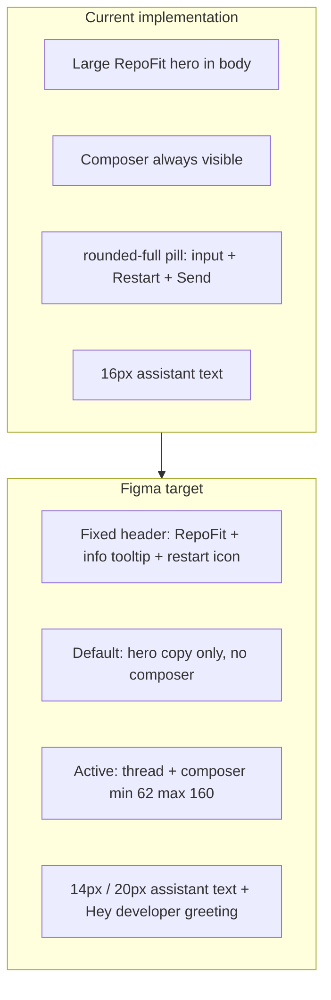

# Chat UI redesign (Figma 2036:255 / 286 / 376)

## Design source (verified via Figma Desktop MCP)

| Screen | Node | Key specs |
|--------|------|-----------|
| Default | [2036:255](https://www.figma.com/design/nrYEskyiPD0bObV45k7fVq/RepoFit?node-id=2036-255) | Shared header; centered copy (no composer); **Start** uses `rounded-[12px]` `px-[14px] py-[8px]` |
| After Start | [2036:286](https://www.figma.com/design/nrYEskyiPD0bObV45k7fVq/RepoFit?node-id=2036-286) | Same header; scrollable thread `pt-24` `gap-28`; first bot message includes **"Hey developer,"** + opening question; composer pinned at bottom |
| Composer | [2036:376](https://www.figma.com/design/nrYEskyiPD0bObV45k7fVq/RepoFit?node-id=2036-376) | **min-h 62px**, **max-h 160px**; `rounded-[12px]` border; `pl-20 pr-12 py-12`; send-only (no Restart in bar); disabled send `neutral-300`, enabled `primary` |

**User choice:** Info icon shows a **tooltip** about RepoFit.

---

## Current vs target (high level)

Primary file: [`app/components/preference-elicitation/preference-elicitation-flow.tsx`](app/components/preference-elicitation/preference-elicitation-flow.tsx)

---

## 1. Shared chat header (new component)

**Add** [`app/components/chat/chat-header.tsx`](app/components/chat/chat-header.tsx):

- Full-width bar: `border-b border-neutral-200/50`, `py-5`, inner `max-w-[600px]` centered row (match existing `chat-container` width).
- Left: **RepoFit** — `text-xl font-semibold` (Figma heading1 = 20px semibold).
- **Info icon** (`lucide-react` `BadgeInfo`, 20px): wrap in a small accessible button; show tooltip on hover/focus (native `title` is acceptable for v1; prefer a small accessible tooltip pattern consistent with the repo if one exists).
- **Restart** (`RotateCw` or equivalent, 16px in 38px circular secondary button): `onClick` → existing `handleRestart` from flow; same behavior as today’s Restart (clears session, resets UI). Visible on **both** default and active screens per Figma.

Export restart/info only in header — **remove** Restart from the composer.

---

## 2. Default screen (node 2036:255)

Update the `!hasStarted` branch in [`preference-elicitation-flow.tsx`](app/components/preference-elicitation/preference-elicitation-flow.tsx):

- Render `<ChatHeader onRestart={handleRestart} />` at top.
- Center column content only:
  - Subtitle: **18px** regular `text-neutral-900` — *"Find open-source projects that fit you."*
  - Body: **16px** `text-neutral-500` `leading-[1.44]` — existing description copy.
  - **Start** button: `rounded-button` (12px), not `rounded-full`; keep `setHasStartedOverride(true)`.
- **Do not render** the composer form on this screen (Figma has no input on default).

Remove the oversized `text-5xl` RepoFit title from the body (title lives in header only).

---

## 3. Active chat screen (node 2036:286)

When `hasStarted`:

- Same `<ChatHeader />`.
- Scroll region: `flex-1 min-h-0 overflow-y-auto`, inner `pt-6` (24px), `gap-7` (28px) between turns.
- **First assistant message only** (no prior turns, showing `pendingQuestion`): prepend UI line **"Hey developer,"** then the question body. Keep [`OPENING_QUESTION`](lib/preference-elicitation/constants.ts) unchanged for API/storage; greeting is presentation-only in the flow (or in `AssistantBlock` via an optional `greeting` prop).
- Subsequent questions: use `AssistantBlock` without greeting.

Update [`app/components/chat/chat-turn.tsx`](app/components/chat/chat-turn.tsx) `AssistantBlock`:

- Question text: **14px**, **line-height 20px** (`text-sm` + `leading-5` or map to existing CSS vars `--question-size` / `--question-line-height` in [`app/globals.css`](app/globals.css)).
- Keep `BotAvatar` (32px) and `gap-3` (12px) between avatar and text per Figma `2036:319`.

User answers can stay **16px** `text-neutral-800` (Figma user bubble styling is unchanged in these nodes).

---

## 4. Composer component (node 2036:376)

**Add** [`app/components/chat/chat-composer.tsx`](app/components/chat/chat-composer.tsx) and wire it from the flow.

### Container (outer frame)

| Property | Value |
|----------|--------|
| min-height | **62px** |
| max-height | **160px** |
| border | 1px `neutral-200`, `rounded-[12px]` |
| padding | `pl-5 pr-3 py-3` (20 / 12 / 12 px) |
| background | `bg-bg-color` |
| layout | `flex`; single-line: `items-center gap-2.5`; multiline: `items-start gap-3` |

### Input

- Replace `<input>` with existing [`Textarea`](app/components/ui/textarea.tsx) (`autoResize`).
- Extend `Textarea` (minimal change) to accept optional `minHeight` / `maxHeight` (px) and clamp `resizeTextarea` so `scrollHeight` does not exceed **content area max** derived from container max (160px minus vertical padding and button row).
- When height exceeds single-line threshold (or textarea scrolls), switch container to multiline layout and **pin send button to bottom** (`self-end` / `items-end` wrapper) per Figma **Multiline Text** variant.
- Placeholder: `Type your responses...`
- Typography: 16px, `leading-[1.44]`, placeholder `neutral-400`.

### Send button

- Circular: `p-[11px]`, 16px icon.
- **Disabled** (empty input or submitting): `bg-neutral-300` (matches Figma default state).
- **Enabled**: `bg-button-primary-default-bg-color`.
- Icon: **upward arrow** (Figma send), not rotated `arrow-right` — use `lucide` `ArrowUp` or add `public/icons/arrow-up.svg` exported from design.
- Remove separate Restart control from composer (moved to header).

Form `onSubmit` and `canSend` logic stay in [`preference-elicitation-flow.tsx`](app/components/preference-elicitation/preference-elicitation-flow.tsx); composer is presentational + controlled value.

---

## 5. Layout shell adjustments

In [`preference-elicitation-flow.tsx`](app/components/preference-elicitation/preference-elicitation-flow.tsx):

- Structure: `flex flex-col h-full` → `ChatHeader` → `flex-1 min-h-0` (scroll) → `ChatComposer` (only when `hasStarted`, `shrink-0`, `pb-6` for 24px bottom padding per Figma `pb-[24px]`).
- Keep `max-w-[600px] mx-auto` on inner column; reduce outer `px-4 py-6` if it fights Figma spacing (header is full-bleed border, content 600px).

Recommendations / loading / error blocks remain in the scroll area; they inherit updated assistant typography via `AssistantBlock` / `ChatRecommendations`.

---

## 6. Tokens and cleanup

- [`app/globals.css`](app/globals.css): optionally wire `@theme` utility for question text (14px / 20px) if not already used — vars exist at `--question-size` / `--question-line-height`.
- Delete duplicate [`app/components/ui/textarea 2.tsx`](app/components/ui/textarea%202.tsx) if still accidental duplicate (out of scope unless touched during edit).
- No API or storage changes required.

---

## 7. Manual test checklist

1. `/chat` default: header + centered copy + Start; **no** composer.
2. Start → opening message with "Hey developer," + question; composer at min height ~62px.
3. Type long answer → composer grows; caps at 160px with internal scroll; send button stays bottom-aligned in multiline mode.
4. Send disabled when empty; enabled when trimmed text present.
5. Header restart clears session and returns to default screen.
6. Info icon shows tooltip on hover/focus.
7. Complete flow → recommendations still render; restart from header still works.
