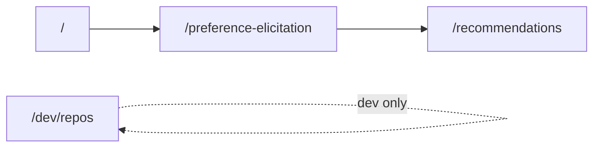

# Codebase Cleanup and Semantic Rename Plan

## Goals

1. **Delete** files that are not referenced anywhere in the app.
2. **Rename** folders/files so names reflect the real features (preference elicitation, matchmaking, recommendations) using conventional Next.js patterns: **kebab-case** route and `lib/` segments, **PascalCase** React components, fixed special files (`page.tsx`, `route.ts`).

No separate naming-rules document applies; align names with [docs/userFlowAndRules.md](docs/userFlowAndRules.md) terminology and existing API routes (`/api/preference-elicitation`, `/api/matchmaking`).

---

## Phase 1 — Safe deletions (no behavior change)

| Item | Action | Rationale |
|------|--------|-----------|
| [public/file.svg](public/file.svg), [globe.svg](public/globe.svg), [next.svg](public/next.svg), [vercel.svg](public/vercel.svg), [window.svg](public/window.svg) | **Delete** | Default `create-next-app` assets; zero references in TSX/CSS |
| [app/components/onboarding/CompletionScreen.tsx](app/components/onboarding/CompletionScreen.tsx) | **Confirm absent** | Already removed per matchmaking plan; only mentioned in `.cursor/plans/` |
| [.cursor/plans/*.plan.md](.cursor/plans/) | **Keep** | Historical; optional cleanup later, not runtime |

**Keep** (look unused but are not):

- [lib/github/logApiResponse.ts](lib/github/logApiResponse.ts) — used by [getBeginnerFriendlyRepos.ts](lib/github/getBeginnerFriendlyRepos.ts) for dev logging during `npm run fetch-repos`
- [app/components/ui/Card.tsx](app/components/ui/Card.tsx), [Button.tsx](app/components/ui/Button.tsx) — used by `RepoCard` / `QuestionStep`
- [docs/projectGoals.md](docs/projectGoals.md) — placeholder; delete only if you explicitly want empty docs removed

---

## Phase 2 — Target naming map

### User-facing routes



| Current | Proposed | Notes |
|---------|----------|-------|
| [app/onboarding/](app/onboarding/) | `app/preference-elicitation/` | Matches domain + storage key prefix in [constants.ts](lib/preferences/constants.ts) (`repofit:preference-elicitation`) |
| [app/repos/](app/repos/) | `app/dev/repos/` | Dev catalog; URL becomes `/dev/repos` per your choice |

Update all `href` / `router.replace` targets:

- [MainContainer.tsx](app/components/home/MainContainer.tsx): `/onboarding?restart=1` → `/preference-elicitation?restart=1`
- [PreferenceElicitationFlow.tsx](app/components/onboarding/PreferenceElicitationFlow.tsx): `/onboarding` → `/preference-elicitation`
- [RecommendationsView.tsx](app/components/recommendations/RecommendationsView.tsx): same for redirects and “Start again”

**Optional:** add temporary redirects in [next.config.ts](next.config.ts) from `/onboarding` and `/repos` to new paths so old bookmarks still work during the course project.

### Component folders

| Current | Proposed |
|---------|----------|
| `app/components/onboarding/` | `app/components/preference-elicitation/` |
| `app/components/repos/` | `app/components/repositories/` |

Files inside can stay as-is (`PreferenceElicitationFlow.tsx`, `QuestionStep.tsx`, `RepoCard.tsx`) — names are already clear; only paths change.

**Optional small renames** (lower priority, same PR or follow-up):

- `MainContainer` → `HomeContent` (home-specific layout, not a generic “main container”)
- `lib/preferences/buildSystemPrompt.ts` → `buildPreferenceElicitationPrompt.ts` to distinguish from [lib/matchmaking/buildSystemPrompt.ts](lib/matchmaking/buildSystemPrompt.ts)

### Shared library

| Current | Proposed |
|---------|----------|
| [lib/preferences/](lib/preferences/) | `lib/preference-elicitation/` |

Update every `@/lib/preferences/*` import (~8 files: API routes, flow UI, matchmaking runner, storage).

API route folder [app/api/preference-elicitation/](app/api/preference-elicitation/) already matches — **no change**.

Matchmaking (`lib/matchmaking/`, `app/api/matchmaking/`, `app/recommendations/`) names are already consistent — **no change**.

### Documentation (kebab-case + domain terms)

| Current | Proposed |
|---------|----------|
| [docs/userFlowAndRules.md](docs/userFlowAndRules.md) | `docs/preference-elicitation-user-flow.md` |
| [docs/preferenceElicitationStrategy.md](docs/preferenceElicitationStrategy.md) | `docs/preference-elicitation-strategy.md` |
| [docs/matchMakingEngine.md](docs/matchMakingEngine.md) | `docs/matchmaking-engine.md` |
| [docs/githubFetchTask.md](docs/githubFetchTask.md) | `docs/github-fetch-requirements.md` |

**Critical:** update hardcoded reads in:

```12:14:lib/preferences/buildSystemPrompt.ts
    readDoc("userFlowAndRules.md"),
    readDoc("preferenceElicitationStrategy.md"),
```

```11:11:lib/matchmaking/buildSystemPrompt.ts
  const matchmakingEngine = await readDoc("matchMakingEngine.md");
```

Also fix **stale content** inside `matchmaking-engine.md` while renaming: it still says the model reads `github-api-response.json`, but runtime uses `logs/matchmaking-repos.json` ([loadRepoDataset.ts](lib/matchmaking/loadRepoDataset.ts)). Update that section so docs match implementation.

Sweep **internal markdown links** in `docs/` and [README.md](README.md) for old filenames and `/onboarding` paths.

---

## Phase 3 — Implementation order (minimize broken intermediate state)

1. **Delete** unused `public/*.svg` defaults.
2. **Rename `lib/preferences` → `lib/preference-elicitation`** and fix all TypeScript imports (run `tsc` / build).
3. **Rename `docs/*`** and update `readDoc(...)` paths + cross-references in markdown.
4. **Move/rename app routes and component directories**; fix imports and navigation URLs in one pass.
5. **Move** [app/repos/page.tsx](app/repos/page.tsx) → `app/dev/repos/page.tsx`; adjust page title/copy to indicate dev/debug if desired (e.g. “Dev: repository catalog”).
6. **Run** `npm run lint` and `npm run build`.
7. **Manual smoke test:** home → elicitation → recommendations; visit `/dev/repos`; run `npm run fetch-repos` if testing matchmaking.

---

## Phase 4 — What we are not deleting/renaming

| Item | Reason |
|------|--------|
| `PreferenceProfile` / `profile` on session | Still returned by elicitation API and stored in session; matchmaking intentionally uses `turns` only — field shrink is a separate API change |
| [scripts/fetchMatchmakingRepos.ts](scripts/fetchMatchmakingRepos.ts) | Active; powers `npm run fetch-repos` |
| GitHub lib (`getBeginnerFriendlyRepos`, `client`, etc.) | Shared by fetch script, dev repos page, and dataset pipeline |
| `logs/` JSON files | Gitignored runtime data, not repo files |

---

## Risk checklist

- **Broken imports:** use project-wide search for `lib/preferences`, `components/onboarding`, `components/repos`, `/onboarding`, old doc filenames.
- **Stale localStorage:** storage key is already `repofit:preference-elicitation` — route rename does not invalidate sessions.
- **Course/docs links:** if graders use `/onboarding`, add redirects or document the new URL in README.

---

## Suggested verification

- `npm run build` passes
- Main flow: `/` → `/preference-elicitation` → `/recommendations`
- Dev catalog: `/dev/repos` renders 100 `RepoCard`s
- Elicitation + matchmaking APIs still respond after `lib/` rename
