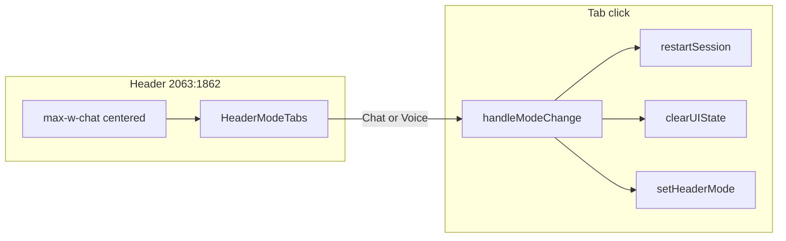

# Figma app header with tab-triggered restart

## Design target (Figma `2063:1862`)

Verified via Figma Desktop MCP for [RepoFit node 2063:1862](https://www.figma.com/design/nrYEskyiPD0bObV45k7fVq/RepoFit?node-id=2063-1862):

- Full-width header: `bg-bg-color`, bottom border `neutral-200` (~0.5px), vertical padding **20px** (`py-5`)
- Inner row: **600px** (`max-w-chat`), horizontally centered in the viewport
- **Only** Chat / Voice mode tabs (child `2063:1572` / `Frame1`) — no RepoFit title, no info icon, **no reload button**
- Tab specs (unchanged from existing [`header-mode-tabs.tsx`](app/components/chat/header-mode-tabs.tsx)):
  - Tab list gap: **8px** (keep your prior dev tweak; Figma export shows 13px)
  - Each tab: `px-3 py-2`, `rounded-button` (12px), `gap-header-gap` (10px), 16px Lucide icons, 16px body text
  - Active: `bg-neutral-100`; inactive: `bg-bg-color` (white)



## Behavior change (confirmed)

- **Remove** trailing [`ReloadButton`](app/components/ui/ReloadButton.tsx) from the chat header.
- **Every tab click** (including re-clicking the active tab) runs the same reset as today’s `handleRestart`:
  - `restartSession()` from [`lib/preference-elicitation/storage.ts`](lib/preference-elicitation/storage.ts)
  - Clear `hasStartedOverride`, input, errors, selected repo, recommendations state
  - `router.replace("/")`
  - Set `headerMode` to the clicked tab (`"chat"` | `"voice"`)
- **No** confirmation modal.

## Files to change

### 1. [`app/components/chat/chat-header.tsx`](app/components/chat/chat-header.tsx)

Refactor to match Figma layout directly (stop using generic `Header` left + trailing split for this screen):

- Render a `<header>` with Figma classes above
- Center [`HeaderModeTabs`](app/components/chat/header-mode-tabs.tsx) inside `mx-auto w-full max-w-chat`
- Props: `mode`, `onModeChange` only (drop `onRestart` from `ChatHeaderProps`)
- Keep re-export of `Header` / `REPOFIT_INFO_TOOLTIP` if still useful elsewhere

### 2. [`app/components/preference-elicitation/preference-elicitation-flow.tsx`](app/components/preference-elicitation/preference-elicitation-flow.tsx)

- Replace `handleRestart` + `setHeaderMode` with a single **`handleModeChange`** callback (logic from existing `handleRestart` at lines 270–277, plus `setHeaderMode(mode)`).
- Update `<ChatHeader>`:

```tsx
<ChatHeader mode={headerMode} onModeChange={handleModeChange} />
```

- Remove `onRestart={handleRestart}`.

Empty-state CTA labels (`Chat` / `Talk` based on `headerMode`) stay as-is.

### 3. [`app/components/chat/header-mode-tabs.tsx`](app/components/chat/header-mode-tabs.tsx)

- Minor polish only if needed: ensure `onChange` fires on every click (already does via `selectMode`).
- Optional: add `aria-label` hint that selecting a tab restarts the session (accessibility).

### 4. [`app/components/ui/Header.tsx`](app/components/ui/Header.tsx) (optional cleanup)

- Leave generic `Header` + `onRestart` / `ReloadButton` in place for now (no other callers), or add a short comment that chat uses `ChatHeader` instead.
- No functional requirement to delete `ReloadButton` unless you want dead-code cleanup in a follow-up.

## What stays the same

- Session storage and opening question flow via `restartSession()`
- `/?restart=1` deep link in [`preference-elicitation-flow.tsx`](app/components/preference-elicitation/preference-elicitation-flow.tsx) (home `Get Started` link) — unchanged
- Text chat UI, composer, and recommendations layout below the header
- Lucide icons (`MessageCircle`, `AudioLines`) instead of Figma localhost SVG assets

## Manual verification

1. Default screen: header shows centered Chat / Voice tabs only; **no** reload icon.
2. Start conversation, submit a turn → click **Voice** → full reset, voice mode active, empty state shows **Talk** CTA.
3. Mid-flow on Voice → click **Voice** again → reset again (no dialog).
4. Click **Chat** from any state → reset to fresh chat-mode empty state with **Chat** CTA.
5. Tab active/inactive styles match Figma (neutral-100 vs white backgrounds).
