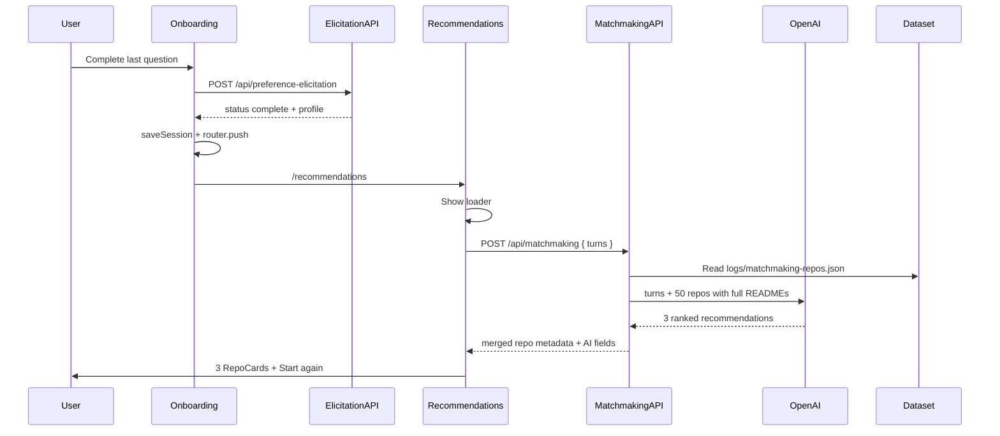

# Matchmaking Recommendations Implementation Plan

## Context

Per updated [docs/userFlowAndRules.md](docs/userFlowAndRules.md) Step 6, elicitation completion must **not** show "Completed." — it should immediately transition into repository matchmaking per [docs/matchMakingEngine.md](docs/matchMakingEngine.md).

**Current state:** [PreferenceElicitationFlow.tsx](app/components/onboarding/PreferenceElicitationFlow.tsx) renders [CompletionScreen.tsx](app/components/onboarding/CompletionScreen.tsx) when `status === "complete"`. No matchmaking code exists. GitHub data is fetched live on `/repos` via [getBeginnerFriendlyRepos.ts](lib/github/getBeginnerFriendlyRepos.ts) and dev-logged to `logs/github-api-response.json` **without** README bodies.

**Decisions locked in:**
- Extend `RepoCard` with AI reasoning fields
- New `/recommendations` route with loader
- Separate `POST /api/matchmaking` (not chained into elicitation API)
- 50 repos with **full READMEs**, fetched once → `logs/matchmaking-repos.json` (already gitignored)
- Show exactly 3 recommendations; re-run matchmaking on every visit
- Keep `PreferenceProfile` extraction; matchmaking input is `turns` only
- Model: `gpt-5.4-nano` (update default in [constants.ts](lib/preferences/constants.ts))
- Errors: message + Start again; include Start again on success screen

---

## Architecture



---

## Phase 1 — Generate matchmaking dataset (do first)

### 1.1 Fetch script

Create [`scripts/fetchMatchmakingRepos.ts`](scripts/fetchMatchmakingRepos.ts):

- Import and call `getBeginnerFriendlyRepos(50)` from [getBeginnerFriendlyRepos.ts](lib/github/getBeginnerFriendlyRepos.ts) (count param already supported via default override)
- Write output to **`logs/matchmaking-repos.json`** with shape:

```ts
{
  timestamp: string;
  repoCount: number;
  repos: RepoSummary[]; // includes full readme string, not readmeLength
}
```

- Reuse existing README batch fetching in `attachReadmes()` — no truncation for matchmaking dataset
- Requires `GITHUB_TOKEN` in env (optional but recommended for rate limits)

### 1.2 npm script

Add to [package.json](package.json):

```json
"fetch-repos": "npx tsx scripts/fetchMatchmakingRepos.ts"
```

Use `tsx` as a devDependency (or equivalent) for running TypeScript scripts.

### 1.3 Prerequisite gate

Matchmaking API must fail clearly if `logs/matchmaking-repos.json` is missing (503 with message like "Run npm run fetch-repos first"). Document this in README.

**Note:** File lives under `/logs/` which is already in [.gitignore](.gitignore). You will generate it locally; committing it is deferred.

---

## Phase 2 — Matchmaking server layer

Mirror the elicitation pattern in [`lib/preferences/`](lib/preferences/) and [`app/api/preference-elicitation/route.ts`](app/api/preference-elicitation/route.ts).

### 2.1 Types — `lib/matchmaking/types.ts`

```ts
export type RepositoryRecommendation = {
  rank: 1 | 2 | 3;
  fullName: string;
  url: string;
  whyThisMatches: string;
  matchHighlights: string[];
  tradeoffs: string[];
};

export type MatchmakingResult = {
  recommendations: Array<RepoSummary & { recommendation: RepositoryRecommendation }>;
};
```

Model returns reasoning keyed by `fullName`; server merges with dataset metadata.

### 2.2 System prompt — `lib/matchmaking/buildSystemPrompt.ts`

Follow [buildSystemPrompt.ts](lib/preferences/buildSystemPrompt.ts) pattern:

- Read [docs/matchMakingEngine.md](docs/matchMakingEngine.md) at runtime
- Instruct JSON-only output with **exactly 3** ranked recommendations
- Required fields per repo: `fullName`, `url`, `whyThisMatches`, `matchHighlights`, `tradeoffs`
- Explicitly: use full `turns` conversation as primary signal; do **not** use a summarized profile
- Constraint: only recommend repos from the provided catalog (`fullName` must match)

### 2.3 Dataset loader — `lib/matchmaking/loadRepoDataset.ts`

- Read `logs/matchmaking-repos.json`
- Validate `repos` array length > 0
- Return typed `RepoSummary[]`
- Throw descriptive error if file missing or malformed

### 2.4 Runner — `lib/matchmaking/runMatchmaking.ts`

Follow [runElicitationStep.ts](lib/preferences/runElicitationStep.ts):

1. Load dataset via `loadRepoDataset()`
2. Build messages: system prompt + serialized `turns` (assistant/user pairs, same as elicitation) + repo catalog JSON (all 50 with full READMEs)
3. Call OpenAI Chat Completions with `gpt-5.4-nano` (`process.env.OPENAI_MODEL ?? DEFAULT_OPENAI_MODEL`)
4. Parse JSON response; validate:
   - Exactly 3 items
   - Each `fullName` exists in dataset
   - Required string/array fields present and non-empty
5. Merge AI fields with matching `RepoSummary` from dataset
6. Return sorted by rank

**Risk to monitor:** 50 full READMEs may be large. Proceed as specified; if timeouts occur, per-repo truncation can be a follow-up.

### 2.5 API route — `app/api/matchmaking/route.ts`

```
POST { turns: ElicitationTurn[] }
→ 200 { recommendations: [...] }
→ 400 invalid body
→ 502 invalid model response
→ 503 missing OPENAI_API_KEY or missing dataset file
→ 500 other failures
```

Reuse turn validation pattern from preference-elicitation route.

### 2.6 Model default

Update [lib/preferences/constants.ts](lib/preferences/constants.ts):

```ts
export const DEFAULT_OPENAI_MODEL = "gpt-5.4-nano";
```

Applies to both elicitation and matchmaking unless overridden by env.

---

## Phase 3 — UI and flow changes

### 3.1 Onboarding completion → navigate

Update [PreferenceElicitationFlow.tsx](app/components/onboarding/PreferenceElicitationFlow.tsx):

- On `result.status === "complete"`: save session, then `router.push("/recommendations")`
- Remove `CompletionScreen` usage (lines 96–98 and 134–136)
- If user lands on `/onboarding` with `status === "complete"`, redirect to `/recommendations` (so refresh doesn't dead-end)

Delete [CompletionScreen.tsx](app/components/onboarding/CompletionScreen.tsx) once replaced.

### 3.2 Recommendations page

Create [`app/recommendations/page.tsx`](app/recommendations/page.tsx) with a client component (e.g. `RecommendationsView.tsx`):

**On mount:**
1. Read session via `getSessionSnapshot()` from [storage.ts](lib/preferences/storage.ts)
2. If `status !== "complete"` or `turns.length === 0` → redirect to `/onboarding`
3. Show loader ("Finding repositories for you…")
4. `POST /api/matchmaking` with `{ turns: session.turns }` — **always**, no result caching
5. Success → render 3 cards
6. Error → error message + Start again link to `/onboarding?restart=1`

**Re-run behavior:** Revisiting `/recommendations` always triggers a fresh API call.

### 3.3 Extend RepoCard

Update [RepoCard.tsx](app/components/repos/RepoCard.tsx):

Add optional prop:

```ts
recommendation?: {
  rank: number;
  whyThisMatches: string;
  matchHighlights: string[];
  tradeoffs: string[];
};
```

When present, render below existing metadata:
- Rank label (#1, #2, #3)
- **Why this matches** — paragraph
- **Match highlights** — bullet list
- **Tradeoffs** — bullet list

Existing [/repos](app/repos/page.tsx) page unchanged (no `recommendation` prop).

### 3.4 Recommendations layout

- Page header: "Your recommended repositories"
- Brief subtext explaining personalized picks
- Vertical list of 3 `RepoCard`s
- Start again button (same pattern as old CompletionScreen — link to `/onboarding?restart=1`)

Reuse existing UI primitives: [Text](app/components/ui/Text.tsx), [Button](app/components/ui/Button.tsx), [Card](app/components/ui/Card.tsx).

---

## Phase 4 — Cleanup and docs

- Remove references to CompletionScreen from [.cursor/plans/preference_elicitation_flow_61ec7c68.plan.md](.cursor/plans/preference_elicitation_flow_61ec7c68.plan.md) is optional (historical)
- README: document `npm run fetch-repos`, required env vars (`OPENAI_API_KEY`, `GITHUB_TOKEN`), and that matchmaking reads `logs/matchmaking-repos.json`

---

## File checklist

| Action | File |
|--------|------|
| Create | `scripts/fetchMatchmakingRepos.ts` |
| Create | `lib/matchmaking/types.ts` |
| Create | `lib/matchmaking/buildSystemPrompt.ts` |
| Create | `lib/matchmaking/loadRepoDataset.ts` |
| Create | `lib/matchmaking/runMatchmaking.ts` |
| Create | `app/api/matchmaking/route.ts` |
| Create | `app/recommendations/page.tsx` (+ client component) |
| Modify | `lib/preferences/constants.ts` — model default |
| Modify | `app/components/onboarding/PreferenceElicitationFlow.tsx` — navigate on complete |
| Modify | `app/components/repos/RepoCard.tsx` — AI fields |
| Delete | `app/components/onboarding/CompletionScreen.tsx` |
| Modify | `package.json` — `fetch-repos` script + `tsx` devDep |

---

## Manual test plan

1. Run `npm run fetch-repos` with valid `GITHUB_TOKEN`; confirm `logs/matchmaking-repos.json` has 50 repos with non-null `readme` where available
2. Complete onboarding flow; verify redirect to `/recommendations` with loader
3. Verify 3 ranked RepoCards with why/highlights/tradeoffs
4. Refresh `/recommendations`; confirm matchmaking re-runs (loader appears again)
5. Visit `/recommendations` without completed session; verify redirect to `/onboarding`
6. Simulate API failure; verify error + Start again
7. Confirm `/repos` page still renders unchanged RepoCards
