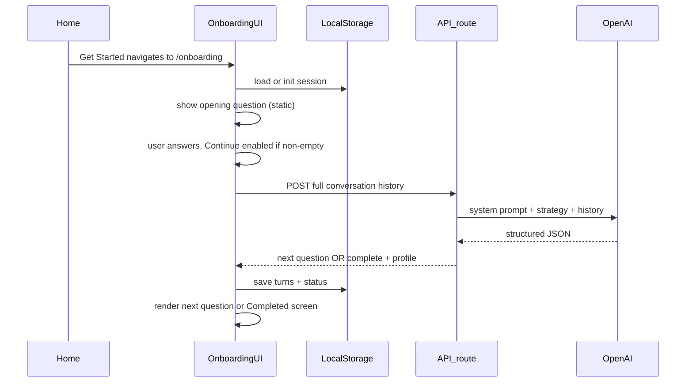

# Preference Elicitation Flow

## Scope (this milestone)

Per [docs/userFlowAndRules.md](docs/userFlowAndRules.md) and [docs/preferenceElicitationStrategy.md](docs/preferenceElicitationStrategy.md):

- **In scope:** Entry from home → conversational Q&A (1 fixed opening + up to 4 adaptive follow-ups) → **Completed.** screen
- **Out of scope:** Repository recommendations, matchmaking engine integration, profile persistence to a database

You chose: **configurable OpenAI model via env** (not locked to `gpt-5.4-nano`) and **localStorage persistence** until completion.

---

## Architecture



| Layer | Responsibility |
|-------|----------------|
| **UI (client)** | Question display, textarea input, disabled **Continue** until `trim().length > 0`, loading/error states, localStorage sync |
| **API route (server)** | Validate payload, load strategy into system prompt, call OpenAI, enforce max question count, return typed JSON |
| **lib/preferences** | Types, opening question constant, prompt builder, OpenAI client wrapper |

---

## Routing and entry

1. Add route [`app/onboarding/page.tsx`](app/onboarding/page.tsx) rendering a client orchestrator (page shell aligned with Figma — see design section below).
2. Wire **Get Started** in [`MainContainer.tsx`](app/components/home/MainContainer.tsx):
   - Use `next/link` to `/onboarding` (avoid nesting `<button>` inside `<a>` — either pass `href` to a small Button extension or style `Link` with existing `buttonVariants` classes from [`Button.tsx`](app/components/ui/Button.tsx)).

---

## Figma design reference (question screen)

**Source:** [RepoFit — Main Container (questions)](https://www.figma.com/design/nrYEskyiPD0bObV45k7fVq/RepoFit?node-id=2012-67&m=dev)  
**Node:** `2012:67` (`Main Container`) — use for all question steps (opening + adaptive follow-ups).

Implement [`QuestionStep`](app/components/onboarding/QuestionStep.tsx) to match this frame. Reuse existing project primitives (`Text`, `Button`, `cn`, Figtree font) rather than raw Figma export markup.

### Layout structure

```
MainContainer (gap-40, p-10)
├── ContentColumn (flex-1, gap-40)
│   ├── QuestionBlock (gap-20)
│   │   ├── CloseButton (44×44, lucide X → navigate home or back)
│   │   └── QuestionText (18px semibold, leading 1.6, foreground)
│   └── ResponseArea (borderless textarea, placeholder below question)
└── ContinueButton (pinned to bottom of column via flex-1 + margin)
```

| Figma spec | Implementation |
|------------|----------------|
| Outer container `gap-[40px]`, `p-[10px]` | `gap-10 p-2.5` on question screen wrapper |
| Question block inner `gap-[20px]` | `gap-5` between close icon and question |
| Question typography: Figtree SemiBold **18px**, line-height **1.6**, black | New `Text` size variant (e.g. `question`) or dedicated class — **not** existing `5xl`/`2xl` hero sizes |
| Response placeholder: **16px** regular, color **neutral-400** (`#a3a3a3`) | `Textarea` placeholder + token `--neutral-400` in [`globals.css`](app/globals.css) if not present |
| Input style | **Borderless** — no box border; full-width auto-growing textarea (Figma shows inline “Type your response” only) |
| Close control | 44×44 tap target; `lucide/x` — add `public/icons/close.svg` (or equivalent) matching Figma asset |
| Primary button | Same shape as home CTA: `rounded-button` (12px), `pl-4 pr-3 py-3`, 16px label, 20px arrow |
| Button **disabled** | Background `#d4d4d4` (`--button-disabled-bg-color`); text stays `--primary-foreground` per Figma |
| Button **enabled** | Existing `--primary` / hover tokens from [`globals.css`](app/globals.css) |
| Button label in Figma | Shows **“Next Question”** — **override to “Continue”** per [userFlowAndRules.md](docs/userFlowAndRules.md) |
| Arrow icon | Reuse [`public/icons/arrow-right.svg`](public/icons/arrow-right.svg) (already on home button) |

### Doc vs design conflicts (resolved)

| Item | Figma | Docs / plan |
|------|-------|-------------|
| Button copy | Next Question | **Continue** (docs win) |
| Question copy (first step) | Matches strategy opening question | Keep [`OPENING_QUESTION`](lib/preferences/constants.ts) verbatim |
| Completion screen | Not in this node | Separate minimal **Completed.** view per docs (no Figma frame yet) |

### Adaptive questions

Follow-up questions from the API replace only the **question text**; layout, close button, textarea, and button states stay identical to this frame.

---

## UI components

| File | Purpose |
|------|---------|
| [`app/components/onboarding/PreferenceElicitationFlow.tsx`](app/components/onboarding/PreferenceElicitationFlow.tsx) | Client state machine: question step vs completion |
| [`app/components/onboarding/QuestionStep.tsx`](app/components/onboarding/QuestionStep.tsx) | Figma `2012:67` layout: close, question `Text`, borderless `Textarea`, **Continue** `Button` |
| [`app/components/onboarding/CompletionScreen.tsx`](app/components/onboarding/CompletionScreen.tsx) | Displays **Completed.** per docs (simple; not specified in Figma) |
| [`app/components/ui/Textarea.tsx`](app/components/ui/Textarea.tsx) | Borderless multiline input, 16px body, neutral-400 placeholder |
| [`app/components/ui/Button.tsx`](app/components/ui/Button.tsx) | Extend with `disabled` visual variant using `--button-disabled-bg-color` (enabled state unchanged) |

**Question step rules (from docs + Figma):**

- Button label always **Continue** (Figma says “Next Question” — do not ship that label)
- `disabled` when answer is empty or whitespace-only → disabled button styling from Figma
- Disable input + button while awaiting API response
- Show minimal inline error + retry on API failure
- Close (X) exits flow (e.g. `Link` to `/`) without clearing localStorage unless user completes or we add explicit reset later

**Opening question:** hardcode the exact copy from [preferenceElicitationStrategy.md](docs/preferenceElicitationStrategy.md) in [`lib/preferences/constants.ts`](lib/preferences/constants.ts) — matches Figma first-screen copy; no API call on first paint.

---

## Conversation state (localStorage)

**Key:** e.g. `repofit:preference-elicitation`

**Shape (example):**

```ts
{
  status: "in_progress" | "complete";
  turns: { question: string; answer: string }[];
  pendingQuestion: string | null; // current unanswered question
  profile?: PreferenceProfile; // set on completion
}
```

**Behavior:**

- On mount: hydrate from localStorage; if `status === "complete"`, show completion screen immediately
- After each successful **Continue**: append answer, persist, then fetch next step
- On completion: set `status: "complete"`, store normalized `profile`, clear `pendingQuestion`
- Optional: expose a dev-only "Start over" control (clears key) — only if useful for testing; otherwise refresh mid-flow resumes from storage

---

## Server API

**Route:** [`app/api/preference-elicitation/route.ts`](app/api/preference-elicitation/route.ts) — `POST` only

**Request body:**

```ts
{ turns: { question: string; answer: string }[] }
```

**Response (structured JSON from model, validated with Zod or manual checks):**

```ts
{ status: "continue"; question: string }
| { status: "complete"; profile: PreferenceProfile }
```

**Server logic:**

1. Reject empty/whitespace-only latest answer
2. Build messages from full `turns` history (not last answer only) — maps to doc requirement for full elicitation context
3. System prompt includes:
   - Role + rules from [userFlowAndRules.md](docs/userFlowAndRules.md) (model responsibilities, max questions, conversational tone)
   - Full text of [preferenceElicitationStrategy.md](docs/preferenceElicitationStrategy.md) (read via `fs.readFile` at runtime from `docs/`)
   - Instruction to return **only JSON** matching the response schema
4. Call OpenAI Chat Completions via official `openai` SDK (new dependency in [`package.json`](package.json))
5. **Guardrails:**
   - If assistant turns already at max (1 opening + 4 follow-ups = 5 total questions shown), force `status: "complete"` even if model asks another question
   - If model returns invalid JSON, return 502 with safe error message

**Model config (your choice):**

| Env var | Purpose |
|---------|---------|
| `OPENAI_API_KEY` | Required — server only, never exposed to client |
| `OPENAI_MODEL` | Optional override; default to a stable small model (e.g. `gpt-4o-mini`) since docs model may be unavailable |

Do **not** add `NEXT_PUBLIC_*` for the API key.

---

## lib/preferences module

| File | Contents |
|------|----------|
| [`lib/preferences/constants.ts`](lib/preferences/constants.ts) | `OPENING_QUESTION`, `MAX_QUESTIONS = 5`, storage key |
| [`lib/preferences/types.ts`](lib/preferences/types.ts) | `PreferenceProfile`, `ElicitationTurn`, API request/response types |
| [`lib/preferences/validation.ts`](lib/preferences/validation.ts) | `isValidAnswer(text: string)` |
| [`lib/preferences/buildSystemPrompt.ts`](lib/preferences/buildSystemPrompt.ts) | Assemble system prompt from docs + JSON output contract |
| [`lib/preferences/runElicitationStep.ts`](lib/preferences/runElicitationStep.ts) | OpenAI call + parse/validate response |
| [`lib/preferences/storage.ts`](lib/preferences/storage.ts) | `loadSession` / `saveSession` / `clearSession` (client-safe, guards `typeof window`) |

`PreferenceProfile` fields align with strategy doc example: `skills`, `interests`, `experience`, `goal`, `contributionStyle`, `difficultyPreference`, `timeCommitment`, `careerDirection` (all optional strings/arrays as inferred).

---

## Environment setup (for you)

Create **`.env.local`** at project root (already gitignored):

```bash
OPENAI_API_KEY=sk-...
OPENAI_MODEL=gpt-4o-mini   # optional; change when you have access to another model
```

Existing GitHub token pattern in [`lib/github/client.ts`](lib/github/client.ts) stays separate (`GITHUB_TOKEN`).

Add a short **Environment variables** subsection to [`README.md`](README.md) documenting both keys.

---

## Dependency

- Add `openai` (official SDK) to `dependencies`

---

## Testing checklist

1. Home **Get Started** → `/onboarding` with opening question visible
2. Question screen matches Figma `2012:67`: close icon, 18px question, borderless input, disabled/enabled button states
3. **Continue** disabled on empty / whitespace-only input (disabled gray button per Figma)
4. First answer triggers API; follow-up feels contextual (uses prior answers in prompt); follow-up screens reuse same layout
5. Flow stops at or before 5 questions; completion shows **Completed.**
6. Refresh mid-flow restores state from localStorage
7. After completion, revisit `/onboarding` shows **Completed.** (until storage cleared)
8. Missing `OPENAI_API_KEY` → clear server error, no key leakage to client

---

## Files touched (summary)

**New:** `app/onboarding/page.tsx`, `app/api/preference-elicitation/route.ts`, `app/components/onboarding/*`, `app/components/ui/Textarea.tsx`, `lib/preferences/*`

**Modified:** [`app/components/home/MainContainer.tsx`](app/components/home/MainContainer.tsx), [`app/components/ui/Button.tsx`](app/components/ui/Button.tsx), [`app/components/ui/Text.tsx`](app/components/ui/Text.tsx), [`app/globals.css`](app/globals.css), [`package.json`](package.json), [`README.md`](README.md) (env docs)

**Assets:** `public/icons/close.svg` (if not reusing another icon)

**Unchanged this milestone:** [`app/repos/page.tsx`](app/repos/page.tsx), GitHub lib, matchmaking
